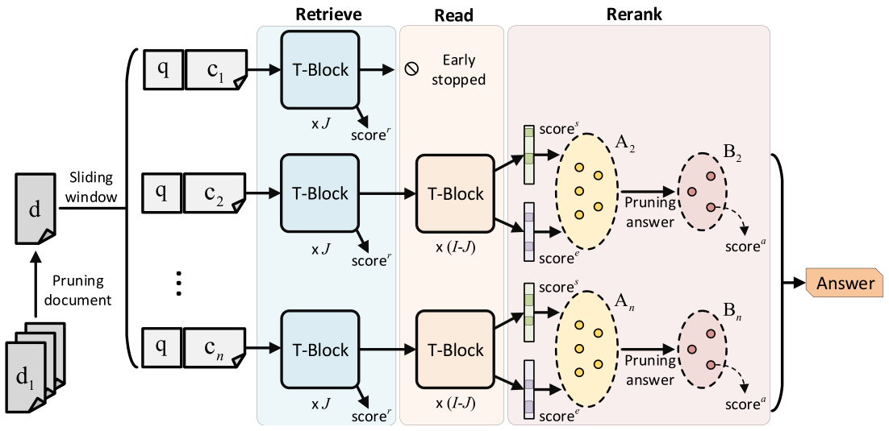

# Retrieve, Read, Rerank: Towards End-to-End Multi-Document Reading Comprehension

This repo contains the code of the following paper:

<i> [Retrieve, Read, Rerank: Towards End-to-End Multi-Document Reading Comprehension](https://arxiv.org/abs/1906.04618). Minghao Hu, Yuxing Peng, Zhen Huang, Dongsheng Li. ACL 2019.</i>

In this paper, we propose an end-to-end neural network for the multi-document reading comprehension task, which is shown as below:
<p>

</p>

This network consists of three components:
- Early-stopped retriever
- Distantly-supervised reader
- Answer reranker

Given multiple documents, the network is designed to retrieve relevant document content, propose multiple answer candidates, and finally rerank these candidates. We utilize [BERT](https://github.com/huggingface/pytorch-pretrained-BERT) to initialize our network. The whole network is trained end-to-end with a multi-task objective.

## Pre-trained Models
To reproduce our results, we release the following pre-trained models:
- [squad_doc_base](https://drive.google.com/file/d/16lTmN2wu31QdUvExW_fGcDJxKnR7f912/view?usp=sharing)
- [triviaqa_wiki_base](https://drive.google.com/file/d/1Re_2KxBlCQ9_sxTmkZGoahjX72c1eCfk/view?usp=sharing)
- [triviaqa_unfiltered_base](https://drive.google.com/file/d/1kqF40UhJAC6XkAbywI-YMIg_C5t0oS2Q/view?usp=sharing)

## Requirements
- Python 3.6
- [Pytorch 1.1](https://pytorch.org/)
- [Allennlp](https://allennlp.org/)

Download the uncased [BERT-Base](https://drive.google.com/file/d/13I0Gj7v8lYhW5Hwmp5kxm3CTlzWZuok2/view?usp=sharing) model and unzip it in the current directory. 

## SQuAD-document
To run experiments on the SQuAD-document dataset, first set up the environment:
```bash
export DATA_DIR=data/squad
export BERT_DIR=bert-base-uncased
```

Make sure `train-v1.1.json` and `dev-v1.1.json` are placed in `DATA_DIR`.

Then run the following command to train the model:
```shell
python -m bert.run_squad_document_full_e2e \
  --vocab_file $BERT_DIR/vocab.txt \
  --bert_config_file $BERT_DIR/bert_config.json \
  --init_checkpoint $BERT_DIR/pytorch_model.bin \
  --do_train \
  --do_predict \
  --data_dir $DATA_DIR \
  --train_file train-v1.1.json \
  --predict_file dev-v1.1.json \
  --train_batch_size 32 \
  --learning_rate 3e-5 \
  --num_train_epochs 2.0 \
  --output_dir out/squad_doc/01
```
In our experiment, the model was trained with 4 NVIDIA TESLA P100 (16GB memory per card). The training took nearly 22 hours to converge. If you do not have enough GPU capacity, you can change several hyper-parameters such as (
these changes might cause performance degradation.):
- `--train_batch_size`: total batch size for training.
- `--n_para_train`: the number of paragraph retrieved by TF-IDF during training (denoted as `K` in our paper).
- `--n_best_size_rank`: the number of segments retrieved by early-stopped retriever (denoted as `N` in our paper).
- `--num_hidden_rank`: the number of Transformer blocks used for retrieving (denoted as `J` in our paper).
- `--gradient_accumulation_steps`: number of updates steps to accumulate before performing a backward/update pass.
- `--optimize_on_cpu`: whether to perform optimization and keep the optimizer averages on CPU.

Finally, you can get a dev result from `out/squad_doc/01/performance.txt` like this:
```bash
Ranker, type: test, step: 19332, map: 0.891, mrr: 0.916, top_1: 0.880, top_3: 0.945, top_5: 0.969, top_7: 0.977, retrieval_rate: 0.558
Reader, type: test, step: 19332, test_em: 77.909, test_f1: 84.817
```

## SQuAD-open
Once you have trained a model on document-level SQuAD, you can evaluate it on the open-domain version of SQuAD dataset.

First, download the pre-processed [SQuAD-open dev set](https://drive.google.com/file/d/1oBqoNNGVV2yCKvEWv5k91PBUHNDl5q8J/view?usp=sharing) and place it in `data/squad/`

Then run the following command to evaluate the model:
```shell
python -m bert.run_squad_document_full_e2e \
  --vocab_file $BERT_DIR/vocab.txt \
  --bert_config_file $BERT_DIR/bert_config.json \
  --do_predict_open \
  --data_dir $DATA_DIR \
  --output_dir out/squad_doc/01
```

You can get a dev result from `out/squad_doc/01/performance.txt` like this:
```bash
Ranker, type: test_open, step: 19332, map: 0.000, mrr: 0.000, top_1: 0.000, top_3: 0.000, top_5: 0.000, top_7: 0.000, retrieval_rate: 0.190
Reader, type: test_open, step: 19332, em: 40.123, f1: 48.358
```

## TriviaQA
### Data Preprocessing
The raw TriviaQA data is expected to be unzipped in `data/triviaqa`. Training
or testing in the unfiltered setting requires the unfiltered data to be 
download to `data/triviaqa-unfiltered`.
```bash
mkdir -p data/triviaqa
cd data/triviaqa
wget http://nlp.cs.washington.edu/triviaqa/data/triviaqa-rc.tar.gz
tar xf triviaqa-rc.tar.gz
rm triviaqa-rc.tar.gz

cd ..
wget http://nlp.cs.washington.edu/triviaqa/data/triviaqa-unfiltered.tar.gz
tar xf triviaqa-unfiltered.tar.gz
rm triviaqa-unfiltered.tar.gz
cd ..
```

First tokenize evidence documents by
```shell
python -m triviaqa.evidence_corpus --n_processes 8 --max_tokens 200
```
where paragraphs that are less than 200 words are merged.

Then tokenize questions and locate relevant answers spans in each document. Run
```shell
python -m triviaqa.build_span_corpus {wiki|unfiltered} --n_processes 8
```
to build the desired set. This builds pkl files in "data/triviaqa/{wiki|unfiltered}"

Next, retrieve top-n paragraphs based on TF-IDF to construct the train and dev sets by
```shell
python -m triviaqa.ablate_triviaqa_wiki --n_processes 8 --n_para_train 12 --n_para_dev 14 --n_para_test 14 --do_train --do_dev --do_test
python -m triviaqa.ablate_triviaqa_unfiltered --n_processes 8 --n_para_train 12 --n_para_dev 14 --n_para_test 14 --do_train --do_dev --do_test
cp data/triviaqa/qa/wikipedia-dev.json data/triviaqa/wiki/
cp data/triviaqa-unfiltered/unfiltered-web-dev.json data/triviaqa/unfiltered/
```

### Wikipedia Domain
To run experiments on the TriviaQA-wiki dataset, first set up the environment:
```bash
export DATA_DIR=data/triviaqa/wiki
export BERT_DIR=bert-base-uncased
```

Then run the the following command to train the model:
```shell
python -m bert.run_triviaqa_wiki_full_e2e  \
  --vocab_file $BERT_DIR/vocab.txt \
  --bert_config_file $BERT_DIR/bert_config.json \
  --init_checkpoint $BERT_DIR/pytorch_model.bin \
  --do_train \
  --do_dev \
  --data_dir $DATA_DIR \
  --train_batch_size 32 \
  --learning_rate 3e-5 \
  --num_train_epochs 2.0 \
  --output_dir out/triviaqa_wiki/01
```

Once the training is finished, a dev result can be obtained from `out/triviaqa_wiki/01/performance.txt` as:
```bash
Ranker, type: dev, step: 20088, map: 0.778, mrr: 0.849, top_1: 0.797, top_3: 0.888, top_5: 0.918, top_7: 0.932, retrieval_rate: 0.460
Reader, type: dev, step: 20088, em: 68.510, f1: 72.680
```

### Unfiltered Domain
To run experiments on the TriviaQA-unfiltered dataset, first set up the environment:
```bash
export DATA_DIR=data/triviaqa/unfiltered
export BERT_DIR=bert-base-uncased
```

Then run the the following command to train the model:
```shell
python -m bert.run_triviaqa_wiki_full_e2e  \
  --vocab_file $BERT_DIR/vocab.txt \
  --bert_config_file $BERT_DIR/bert_config.json \
  --init_checkpoint $BERT_DIR/pytorch_model.bin \
  --do_train \
  --do_dev \
  --data_dir $DATA_DIR \
  --dev_file unfiltered-web-dev.json \
  --train_batch_size 32 \
  --learning_rate 3e-5 \
  --num_train_epochs 2.0 \
  --output_dir out/triviaqa_unfiltered/01
```

Once the training is finished, a dev result can be obtained from `out/triviaqa_unfiltered/01/performance.txt` as:
```bash
Ranker, type: dev, step: 26726, map: 0.737, mrr: 0.781, top_1: 0.749, top_3: 0.806, top_5: 0.824, top_7: 0.831, retrieval_rate: 0.392
Reader, type: dev, step: 26726, em: 63.953, f1: 69.506
```

## Acknowledgements
Some preprocessing codes were modified from the [document-qa](https://github.com/allenai/document-qa) implementation.

The BERT implementation is based on [pytorch-pretrained-BERT](https://github.com/huggingface/pytorch-pretrained-BERT).

If you find the paper or this repository helpful in your work, please use the following citation:
```
@inproceedings{hu2019retrieve,
  title={Retrieve, Read, Rerank: Towards End-to-End Multi-Document Reading Comprehension},
  author={Hu, Minghao and Peng, Yuxing and Huang, Zhen and Li, Dongsheng},
  booktitle={Proceedings of ACL},
  year={2019}
}
```
